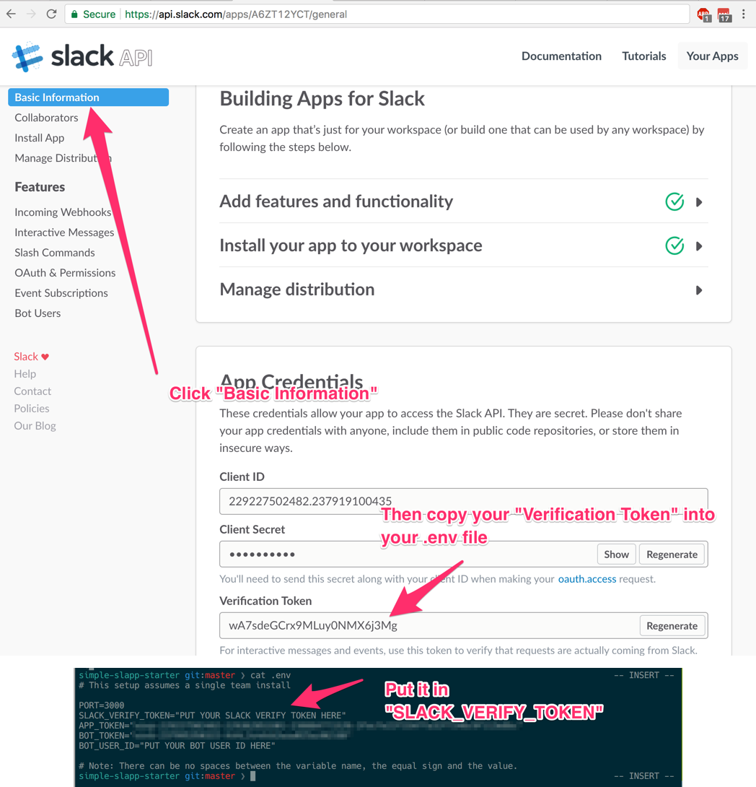

Simple [Slapp](https://github.com/BeepBoopHQ/slapp) Starter
===

Getting started with Slapp (a Slack App framework) or slack apps in general can be difficult but hopefully these instructions will make it easier. 

## Setup

### Step 0 | Clone this repository & run npm install

Clone this repo to your computer and run these commands

```bash
git clone git@github.com:teach-bot/simple-slapp-starter.git
cd simple-slapp-starter
npm install

# Install other things we need 
brew cask install ngrok
```

Open a _new_ terminal window and run

```bash
ngrok http 3000
```

In the original terminal window run 

```bash
npm start
```

### Step 1 | Create a Slack App & Configure Permissions

Visit [https://api.slack.com/apps](https://api.slack.com/apps) and click "Create New App" 


Fill out the form as shown below 👇


Click "Bot Users"


Click "Add a Bot User"


Fill out the form as shown below 👇


Click Event Subscriptions and then the toggle


Follow these steps to add the ngrok url 👇


Scroll down and add the `message.im` bot permission. **Be sure to press "Save Changes" when you're done.


Click "Install App" on the left & then "Install App to Workspace" then click Authorize on the following screen 


Copy the values for the Installed App Settings page to your ".env" file


Copy the value of your verification token to you ".env" file.




### Step 2 | Test your setup in slack

Open the Slack Team that has your bot installed, go to the direct message and try typing `echo ` followed by anything you want. 


